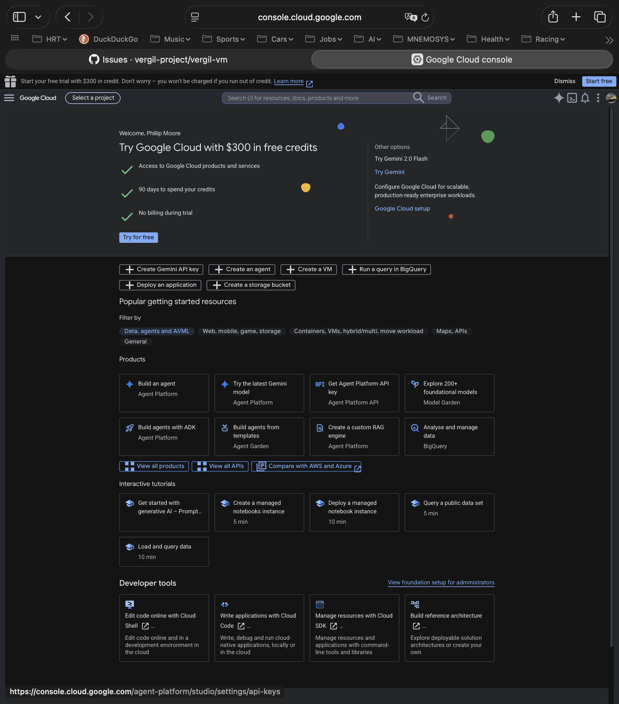
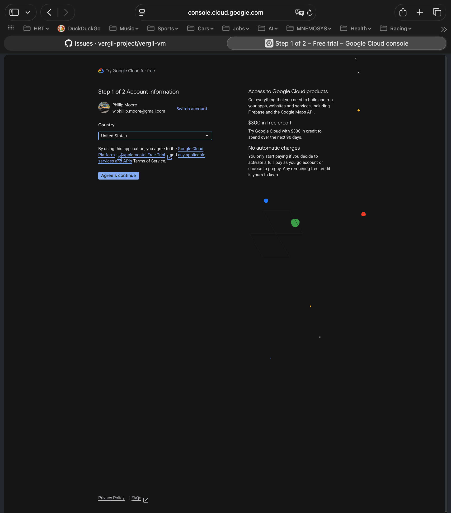

# Off-Platform Cloud Setup (GCP)

A step-by-step guide to standing up the cloud-account prerequisites for the
**off-platform VM backend** (vergil-vm #199): a billed cloud project, host
credentials, permissions, and nested-virtualization quota — everything the
OpenTofu modules need before `vrg-vm create` can stand up a real cloud VM.

This guide is **GCP-first** (the primary target). An **Azure** section captures the
parity steps when that path is set up.

> **The cloud setup is a macOS-host activity.** `gcloud` and the GCP Console run on
> your Mac, and the credential you create here (`gcloud` Application Default
> Credentials) is **host-local — it does not propagate into VMs** the way the GitHub
> App credentials do. It is a distinct class of credential, managed only on the
> operator's Mac.

## When you need this

Only repos that declare the off-platform backend in their `vergil.toml`
(`[vm.<identity>] backend = "off-platform"`) need a cloud project. The default local
Lima backend needs none of this. Today the one consumer is the native-x86 MQ cluster
lab.

## What you will end up with

- A GCP project with billing enabled and the Compute Engine API on.
- `gcloud` installed and authenticated on your Mac (Application Default Credentials).
- IAM permissions to create instances, disks, and firewall rules.
- Confirmed nested-virtualization quota and a working machine-type + region.
- An SSH keypair for the instance.

---

<!--
  CAPTURE-AS-WE-GO. Each step below is filled in with the EXACT commands, console
  paths, and screenshots that actually worked during the first real setup
  (vergil-vm #204). Steps not yet walked through are marked TODO and must not be
  guessed — replace them with verified content only.
-->

## Prerequisites

- A **Google account** that can sign in to [console.cloud.google.com](https://console.cloud.google.com).
- **Homebrew** on your Mac (for the gcloud install below).
- A way to pay: GCP requires a **billing account** (a payment method) before you can
  run instances. We set that up in a later step; you just need a card available.

## Step 1 — Install the Google Cloud CLI (macOS)

The Google Cloud CLI is a Homebrew **cask** named `gcloud-cli`. Install it with:

```bash
brew install --cask gcloud-cli
```

> **Gotcha:** `brew install gcloud` does **not** work — there is no `gcloud`
> *formula*. Homebrew errors with *"No available formula with the name gcloud"* and
> suggests the cask: *"To install gcloud-cli, run: `brew install --cask gcloud-cli`"*.

This installs the Google Cloud SDK (v573.0.0 at the time of writing; it pulls
`python@3.14` as a dependency) and links the core binaries — `gcloud`, `gsutil`,
`bq` — into `/opt/homebrew/bin`, which is already on your `PATH`. So `gcloud` works
immediately; no `PATH` edit is needed for the core tool.

Optionally, enable shell completion and put the SDK's *additional* components on
`PATH` (for `gcloud components install …`) by sourcing the init scripts from your
shell profile (zsh):

```bash
echo 'source "/opt/homebrew/share/google-cloud-sdk/path.zsh.inc"' >> ~/.zshrc
echo 'source "/opt/homebrew/share/google-cloud-sdk/completion.zsh.inc"' >> ~/.zshrc
exec zsh
```

Verify the install:

```bash
gcloud version          # -> Google Cloud SDK 573.0.0, bq, core, gsutil, ...
gcloud auth list        # -> "No credentialed accounts." until you log in (Step 2)
gcloud config list      # -> active configuration: [default], no project yet
```

<!--
  The next three steps are the WEB CONSOLE part — the first-time Google Cloud
  sign-up, project creation, and billing. This is the most confusing part of the
  whole setup and the reason this guide exists. GCP's onboarding UI changes over
  time, so these are captured from what actually appeared during the #204
  walkthrough, with screenshots. Do not guess screens — capture the real flow.
-->

## Step 2 — Sign up for Google Cloud in the Console (free trial)

Go to [console.cloud.google.com](https://console.cloud.google.com) signed in with your
Google account. A brand-new account lands on the Console with a **free-trial
onboarding** front and centre:



What it offers: **$300 in free credits, 90 days, and "no billing during the free
trial."** Click **Try for free** (or **Start free trial** in the top banner) to begin.

**The one decision here — free trial vs. paid:**

- **Take the free trial.** The $300 credit offsets the cost of the off-platform VM
  while you validate the setup, and — importantly — the credit **carries over if you
  later upgrade to a paid account**, so claiming it first costs you nothing.
- **A payment method (card) is still required** to start the trial. Google uses it to
  verify identity; you are **not** charged during the trial unless you explicitly
  upgrade to a paid account or exceed the credit.
- **Expect to upgrade to paid later.** Free-trial accounts come with **restricted
  quotas** — a nested-virt instance for the lab is large (~16 vCPU), and the trial's
  default vCPU quota in a region is likely too low. You will probably need to upgrade
  to a full (paid) billing account to get the quota — we hit this for real at
  Step 10 (quota). The $300 credit still applies after upgrading.

Click **Try for free** and continue to the sign-up form (country, Terms of Service,
and the payment method) — captured in Steps 3–4.

## Step 3 — Sign-up, part 1 of 2: Account information

The free-trial sign-up is two screens. The first is **Account information** — your
**country** plus agreement to the **Terms of Service**:



Pick your **country**, accept the **Google Cloud Platform + Free Trial + APIs Terms of
Service**, and click **Agree & continue**. Note the reassurance on the right — *"No
automatic charges: you only start paying if you decide to activate a full,
pay-as-you-go account or choose to prepay. Any remaining free credit is yours to
keep."*

## Step 4 — Sign-up, part 2 of 2: Payment information

The second screen is **Payment information verification**. It has two blocks, each with
a **Change** link, and a **Start free** button:

- **Contact information** — your name and address, drawn from your **Google payments
  profile**. If you already use Google Play, Google One, or YouTube, GCP **reuses your
  existing payments profile** here rather than asking you to type a new one. (If you
  have no profile yet, you fill in account type — Individual or Business — name, and
  address.)
- **Payment method** — a card. Google verifies it but does **not** charge it: *"this
  trial is still free… you won't be charged unless you manually activate a full
  pay-as-you-go account or choose to prepay."*

Click **Start free** to finish.

> **No screenshot here on purpose.** This screen shows your real payments-profile and
> card details; do not capture it into shared docs.

## Step 5 — Create a dedicated project

Clicking **Start free** lands you back on the Console with the **free trial active** —
a top banner shows *"$300.00 credit and N days remaining"* with an **Activate full
account** button (the upgrade-to-paid path for later), and *"0 of $300 credits used"*.
The sign-up auto-creates a default project called **"My First Project"** with an
auto-generated project number and ID.

### Understand the identifiers (and "No organization") before you name it

A GCP project has three identifiers — only one is permanent:

- **Project name (display name)** — human-friendly, shown in the Console. **Changeable**
  anytime, not unique. Cosmetic.
- **Project ID** — **globally unique across all of GCP**, lowercase letters/digits/
  hyphens, 6–30 chars. **Immutable** — you cannot rename it; "changing" it means
  creating a new project and migrating. It is baked into `gcloud --project`, resource
  paths (`projects/<ID>/…`), **service-account emails**
  (`<name>@<PROJECT_ID>.iam.gserviceaccount.com`), billing reports, and URLs. **This is
  the one to choose deliberately** — pick a clean, purpose-named ID that is **not
  coupled to your personal user id** (the same lesson as moving from a personal GitHub
  account to an org).
- **Project number** — auto-assigned, immutable, numeric. You don't choose it.

**The "No organization" line.** A GCP **Organization** is the top-level owner of
projects — the analog of a GitHub org. It is created from a **Google Workspace or Cloud
Identity** account tied to a **domain you own**; a plain `@gmail.com` account has **no
organization**, so personal projects sit under **"No organization,"** owned by your user
account. An Organization buys: **ownership decoupled from one personal account**,
centralized IAM + org policies, **folders** for hierarchy, and centralized billing — the
same reasons you graduate from personal GitHub repos to an org. The cost is setup: a
domain + Cloud Identity (there is a free tier) and domain verification. You **can** move
a project into an organization later (the **Project ID stays fixed** through the move),
so the safe order is: **choose the ID well now; decide the org consciously** (set it up
now for the clean structure, or stay under "No organization" and migrate later).

**The decision for this use case: "No organization."** These off-platform VMs are a
**personal developer sandbox** — the same Vergil VMs you'd run on your own Mac, extended
to a cloud host for native x86 and more horsepower. They are paid for and managed by
*you*, for *you*; they are **not** shared team infrastructure. The GitHub
"repo = shared resource" analogy breaks down here, so these projects stay under **No
organization** and do **not** migrate to an org later. (Shared Vergil *team*
infrastructure in the cloud — a shared Forgejo, a team service — would be a different
use case that *would* warrant an Organization.)

**Naming, decided:**

- **Display name** — cosmetic and editable; use something friendly, e.g.
  `Vergil Project Personal Sandbox`.
- **Project ID** — instead of accepting GCP's random suggestion (e.g.
  `articulate-fort-500213-e2`), choose a **coherent self-namespace** so all your personal
  Vergil projects share a prefix: `vergil-project-<n>-a1`, `-a2`, … (using the GitHub org
  name `vergil-project` as the prefix). The 6-digit number in GCP's auto-suggestions is
  **not** a stable account id — it drifts across refreshes — so don't read meaning into
  it; just pick a clean prefix you control. The ID is **immutable**, the display name is
  not.

**Don't build on "My First Project."** Create the **dedicated project** with the name/ID
above — it isolates the cloud resources, gives clean billing attribution, and lets you
delete the whole project to clean up later.

1. Open the **project picker** (the project name in the top bar) and choose **New
   Project**.
2. Give it a clear **name** (e.g. `vergil-off-platform`). GCP derives a globally-unique
   **Project ID** from the name (it may append digits); you can edit the ID.
3. Leave **Organization / Location** as **No organization** unless you have one.
4. **Create**, then **select** the new project in the picker.

Record the **Project ID** — you need it for `gcloud config set project <PROJECT_ID>`
(Step 6) and the repo's off-platform profile.

> **Trial billing is account-wide.** The free-trial billing account already covers any
> project you create under it, so a new project is billed to the trial automatically —
> no separate billing setup per project during the trial.

> **Gotcha — accidental creation and "pending deletion."** Pressing **Return** in the
> New Project form can submit it before you've set the name/ID, creating a stray
> project. The project **picker** is an unreliable view of what exists — for the
> authoritative list use the CLI (`gcloud projects list`, after Step 6 auth) or **IAM &
> Admin → Manage Resources**. Deleting a project **soft-deletes** it: it sits under
> **"Resources pending deletion"** for ~30 days (recoverable) before it is purged. So a
> stray project is harmless — list it, delete it, carry on.

<!-- Capture: the New Project form + the selected dedicated project. -->

## Step 6 — Authenticate gcloud (CLI: login + select project)

Once the account, project, and billing exist, point the CLI at them. Log in with your
Google account (opens a browser for OAuth and stores your *user* credential):

```bash
gcloud auth login
gcloud auth list                    # -> your account, marked ACTIVE (*)
gcloud config set project <PROJECT_ID>
gcloud config list                  # -> account + project set
```

> This user login is separate from the **Application Default Credentials** OpenTofu
> uses (Step 8). You need both: the user login to drive `gcloud`, and ADC for `tofu`.

## Step 7 — Enable the Compute Engine API (TODO)

## Step 8 — Application Default Credentials for OpenTofu (TODO)

## Step 9 — IAM permissions (TODO)

## Step 10 — Nested-virtualization quota (TODO)

## Step 11 — Confirm a nested-virt machine type + region (TODO)

## Step 12 — SSH keypair (TODO)

## Next — declare the profile and create the VM (TODO)

---

## Azure (parity — TODO when the Azure path is set up)

The same shape: a subscription with billing, `az login`, a nested-virtualization-capable
SKU, region, and quota.
